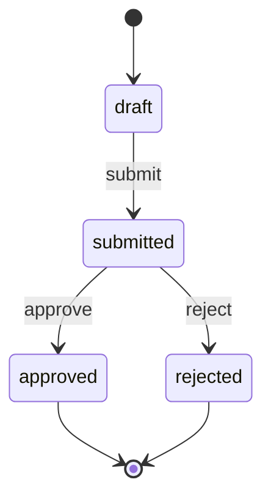

# State Machine Template

## Entity

- Entity:
- Related PRD:
- State owner:
- Persistence location:

## States

| State | Meaning | Entry condition | Exit condition | Terminal |
| --- | --- | --- | --- | --- |
| draft |  |  |  | No |

## Transitions

| ID | From | Event | Guard | To | Actor | Side effects | Error if blocked |
| --- | --- | --- | --- | --- | --- | --- | --- |
| SM-001 | draft | submit |  | submitted |  |  |  |

## Diagram

## Invariants

- 

## Side Effects

| Transition | Side effect | Idempotency rule | Retry behavior |
| --- | --- | --- | --- |
|  |  |  |  |

## Concurrency

- Duplicate event behavior:
- Stale state behavior:
- Locking or transaction expectations:

## Observability

- Metrics:
- Logs:
- Alerts:
- Audit events:
